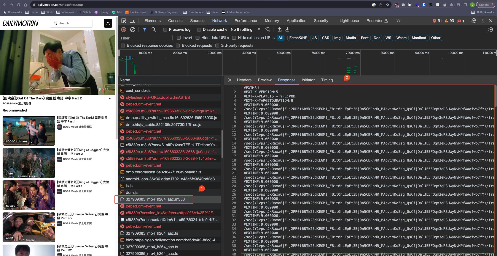

# StreamDown1oader
Download videos from Streaming Platforms

## Requirement
- python
- ffmpeg 
    ```bash
    brew install ffmpeg
     ```

## Installation 

1. clone and cd into this project
   
2. ```bash
    pip install virtualenv    

    python -m venv venv

    source ./venv/bin/activate

    pip install -r requirements.txt
    ```

3. go to developer tool -> network -> look for postfix "m3u8" file<br/>
   1. downloadWithM3U8.py
      1. look for url that downloads m3u8 and paste in m3u8Download.py
      2. edit main() and run program
      - currently only supports:
           - dailymotion
           - PH
   2. download.py
       1. check the response inside the request for m3u8 file
       2. find the first and last number of video fragments
       3. edit main() and run program
       - more versatile, basically support all sites with m3u8 file<br/>
            remarks: look for frag / seg keywords in m3u8 or ts url 😉<br/><br/>
    e.g.</br>
    /sec(Y1vpsrJkRaxa6jF-j2RR0t6BMk26dKEGMI_FBit0hLEpEt3Bj9n5CBRhMR_MAovimKqZsg_QsCfjOalJE5FOqm3eRSUwyNvMPfWAqfwo7fY)/frag(<strong>153</strong>)/video/580/909/327909085_mp4_h264_aac.ts
#EXT-X-ENDLIST
    